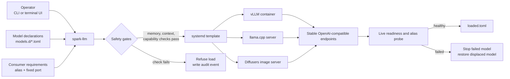

# spark-llm

Model lifecycle management for an NVIDIA DGX Spark: load, unload, inspect, and
promote local LLMs behind stable OpenAI-compatible endpoints.

spark-llm keeps model configuration separate from live state and refuses unsafe
loads before they can overcommit the DGX Spark's unified memory. It supports
vLLM containers, llama.cpp GGUF models, and a Diffusers image-generation
service from one terminal UI and CLI.

## Capabilities

- Memory-aware orchestration on a 128 GB unified-memory system
- Stable consumer aliases while the backing model changes
- Live health checks instead of trusting stale process state
- Test mode, explicit confirmation, audit logging, and rollback on failed loads
- Engine-specific launch composition for vLLM, llama.cpp, and Diffusers
- OpenAI-compatible text, tool-calling, and image-generation endpoints

## Architecture



The data model has three facts:

1. A **declaration** says what a model can run with.
2. A **consumer** says which alias and port an external application needs.
3. **Loaded state** records which declaration is intended to run on each port.

Consumer assignment is derived from the live port, not stored in a second
mapping that can drift.

## Requirements

- NVIDIA DGX Spark with DGX OS
- Docker with NVIDIA Container Toolkit
- Python 3.11 or newer
- `python3-rich` for the terminal UI
- Model weights stored locally, `/srv/models` by default
- Optional: a CUDA-enabled static `llama-server` build for GGUF models

## Quick start

Clone the repository on the DGX Spark, then review `etc/config.toml` and the
example declarations in `etc/models.d/`.

```bash
sudo apt-get install python3-rich
sudo usermod -aG docker "$USER"
# Sign out and back in after changing docker-group membership.

git clone https://github.com/rhranov/spark-llm.git
cd spark-llm
sudo ./install.sh
```

The installer leaves spark-llm in **test mode**. Commands are composed and
audited but not executed until live mode is explicitly enabled.

```bash
spark-llm status
spark-llm list
spark-llm
spark-llm mode live
```

Typical model operations:

```bash
spark-llm load qwen3.6-35b-a3b-nvfp4
spark-llm logs qwen3.6-35b-a3b-nvfp4
spark-llm unload qwen3.6-35b-a3b-nvfp4
```

## Add a model

Place the checkpoint under `/srv/models`. If the folder has no declaration,
the console shows it as undeclared and can generate a conservative starting
declaration from its on-disk metadata.

Review generated flags before live use. Tool-calling parsers and
model-specific kernels cannot be inferred safely from weight files alone.

## Test

Portable unit tests do not require a DGX Spark:

```bash
python3 -m unittest discover -s tests -v
python3 -m py_compile spark_llm.py image_server.py image_server_lib.py
bash -n install.sh
```

On the DGX Spark, after configuring local model paths:

```bash
SPARK_LLM_DIR=/etc/spark-llm python3 test_console_paths.py
```

The integration suite reads real GPU, memory, disk, model, systemd, and endpoint
state. It refuses to run against a live-mode config.

## Safety model

- Missing or invalid mode defaults to non-mutating test mode.
- Every mutation goes through one audited executor.
- Loads are rejected when context, tool-calling, engine compatibility, or
  memory checks fail.
- Docker workloads receive memory caps derived from the same configured ceiling
  used by pre-flight checks.
- Failed readiness triggers bounded rollback to the displaced model.
- systemd limits crash loops and raises the inference workload's OOM priority.
- API ports bind to loopback by default. Remote exposure requires an explicit
  `listen_host` change and an authenticated network boundary.

The operator account is trusted. Docker-group membership is root-equivalent,
and the scoped systemd permission can launch operator-owned declarations.

## Scope

spark-llm targets a single DGX Spark host and local model storage. It is not a
distributed scheduler, model downloader, or authentication gateway. Put
network-facing endpoints behind an authenticated reverse proxy.
